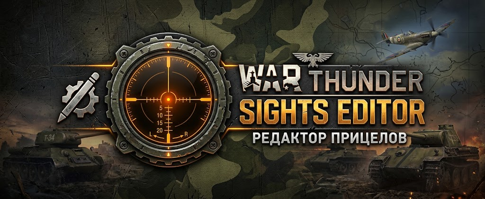
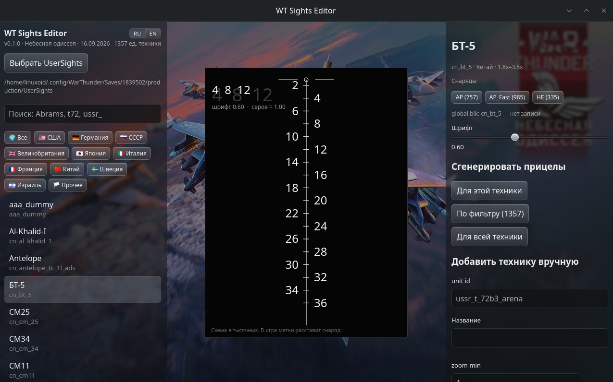

[English](README.en.md) · Русский

# WT Sights Editor



Portable приложение для генерации пользовательских прицелов War Thunder. Каталог техники уже внутри: вы указываете свою папку `UserSights`, программа пишет файлы прицелов на диск и может назначить их технике.

Интерфейс на русском и английском. Номер версии указан в левой боковой панели и на [странице релизов](https://github.com/ath31st/wt_sights_editor/releases).

## Оглавление

- [Благодарности](#благодарности)
- [Отказ от ответственности](#отказ-от-ответственности)
- [Скачать и запустить](#скачать-и-запустить)
- [Как использовать](#как-использовать)
  - [Где находится папка UserSights](#где-находится-папка-usersights)
- [Сборка из исходников](#сборка-из-исходников)
- [Возможные проблемы](#возможные-проблемы)
- [Обновление каталога и релизы](#обновление-каталога-и-релизы)

## Благодарности

Прицелы в программе сделаны по мотивам пользовательских прицелов [Minedeployder](https://live.warthunder.com/user/25154302/). Я долго играл с минималистичными прицелами от Minedeployder, но в старых прицелах не делаются правки (прицелы тигров с мусорной "звездой смерти", например), для некоторой старой техники их просто нет (например, SAV 20.18). И это толкнуло меня на написание этой программы.

## Отказ от ответственности

WT Sights Editor — неофициальная программа для личных прицелов. Она не связана с Gaijin Entertainment и не входит в состав War Thunder. War Thunder и связанные названия принадлежат их правообладателям.

Программа пишет только локальные файлы вашего аккаунта: прицелы в `UserSights` и назначение в `global.blk`. Никакие игровые файлы не затрагиваются и система anticheat не будет блокировать вас даже если программа будет запущена параллельно с игрой. Перед первой записью `global.blk` рядом сохраняется копия `global.blk.wtse.bak`. За свои файлы игры и за использование программы отвечает пользователь.

## Скачать и запустить

1. Скачайте файл для своей системы со [страницы релизов](https://github.com/ath31st/wt_sights_editor/releases).
2. Запустите его.

- **Linux, AppImage** (около 80 МБ, портативный): `wt-sights-editor-<version>-linux-x86_64.AppImage`.
- **Linux, маленький бинарник**: `wt-sights-editor-<version>-linux-x86_64`. Нужен системный WebKitGTK: пакет `webkit2gtk-4.1` в Arch и CachyOS, `libwebkit2gtk-4.1-0` в Debian и Ubuntu.
- **Windows**: `wt-sights-editor-<version>-windows-x86_64.exe`. Нужен WebView2; на Windows 10 и 11 он обычно уже установлен.

**Linux.** Дважды щёлкните по скачанному файлу и подтвердите запуск. Так открываются и AppImage, и бинарник без расширения.

Если удобнее терминал, для AppImage подставьте имя с суффиксом `.AppImage`:

```bash
chmod +x wt-sights-editor-<version>-linux-x86_64
./wt-sights-editor-<version>-linux-x86_64
```

**Windows.** Дважды щёлкните по `wt-sights-editor-<version>-windows-x86_64.exe`.



Слева каталог, фильтры стран и поиск, по центру превью схемы прицела, справа выбранная техника и блок ручного добавления техники (на случай ее отсутствия в каталоге).

## Как использовать

### Где находится папка UserSights

С обновления 2.53 «Line of Contact» эта папка перенесена в сохранения аккаунта. В той же папке `production`, рядом с `UserSights`, лежит `global.blk`: программа читает его, чтобы назначить прицел технике.

**Windows**

```text
C:\Users\<имя>\Documents\My Games\WarThunder\Saves\<ID аккаунта>\production\UserSights
```

В проводнике: Документы → My Games → WarThunder → Saves → папка с ID → production → UserSights.

**Linux**

```text
~/.config/WarThunder/Saves/<ID аккаунта>/production/UserSights
```

ID — имя числовой папки внутри `Saves`. Его видно в профиле на сайте магазина. Если таких папок несколько, последний вход записан в `Saves/lastlogin.blk`.

Папки `UserSights` может ещё не быть. Создайте её внутри `production` и выберите в программе.

1. Нажмите **Выбрать UserSights** и укажите эту папку. Выбранный путь запоминается.
2. Найдите технику поиском (`Abrams`, `t72`, `ussr_`) или фильтром по стране.
3. По центру показана схема в тысячных. В игре метки расставляет снаряд.
4. Ползунок **Шрифт** меняет размер подписей в генерируемых файлах.
5. **Сгенерировать прицелы** пишет файлы в `UserSights`:
   - **Для этой техники** — только выбранная машина;
   - **По фильтру** — то, что сейчас в списке;
   - **Для всей техники** — весь каталог.

   Для каждой машины появляется папка с её unit id и файлы снарядов, которые есть у неё в каталоге: `AP.blk`, `AP_Fast.blk`, `HEAT.blk`, `APDS.blk`, `HE.blk`, `AA.blk`, `SAM.blk`.
6. Кнопка снаряда справа назначает прицел этой машине. Если файла ещё нет, программа его создаёт и прописывает имя в `global.blk`. Перед первой записью рядом появляется копия `global.blk.wtse.bak`.
7. Если War Thunder в этот момент закрыт, при следующем запуске игра сама перечитает настройки и сгенерированные файлы, и прицелы появятся сразу. Назначенный прицел тоже применится при запуске. Если игра уже была открыта, пока вы создавали файлы, новые прицелы нужно перечитать кнопкой **Перезагрузить пользовательский прицел**: сначала в настройках управления посмотрите назначенную клавишу или задайте свою и нажмите её в ангаре, бою или в пробном выезде. Назначенные прицелы при запущенной игре будут видны после перезапуска клиента.
8. Техники нет в каталоге — блок **Добавить технику вручную**: unit id (латиница, цифры и `_`), название, кратность зума и набор снарядов. Такая машина хранится отдельно и остаётся после обновления программы.

## Сборка из исходников

Нужны [Node.js](https://nodejs.org/) и [Rust](https://www.rust-lang.org/tools/install). На Linux для окна ещё пакет WebKit: `libwebkit2gtk-4.1-dev` в Debian и Ubuntu, `webkit2gtk-4.1` в Arch и CachyOS.

```bash
git clone https://github.com/ath31st/wt_sights_editor.git
cd wt_sights_editor
npm install
npm test
npm run tauri:dev
```

## Возможные проблемы

- Окно не открывается на Linux. Для маленького бинарника и сборки из исходников поставьте WebKitGTK (`webkit2gtk-4.1` или `libwebkit2gtk-4.1-0` / `libwebkit2gtk-4.1-dev`). AppImage этот пакет не требует.
- На Windows не хватает WebView2. Установите [WebView2 Runtime](https://developer.microsoft.com/microsoft-edge/webview2/).
- После выбора папки предупреждение, что `global.blk` не найден. Нужна папка `UserSights` внутри `production`: `global.blk` лежит рядом с ней. Без него прицелы записать можно, назначить технике — нет.
- Файлы на диске есть, а в игре их не видно. Если клиент был открыт во время генерации, нажмите **Перезагрузить пользовательский прицел** в ангаре, в бою или в пробном выезде. Если игра была закрыта, прицелы уже должны быть на месте после запуска. Смена назначения в `global.blk` при запущенной игре видна после перезапуска клиента.
- Если с проблемой не удается справиться собственными силами, то можете обратиться к разработчику [Issues](https://github.com/ath31st/wt_sights_editor/issues) или [в Telegram](https://t.me/feedback_genie_bot).


## Обновление каталога и релизы

Каталог машин лежит в `data/catalog.json` и попадает в релиз вместе с программой.

Обновление каталога техники из datamine:

```bash
# git clone --filter=blob:none --sparse --depth 1 \
#   https://github.com/gszabi99/War-Thunder-Datamine.git .cache/datamine
# cd .cache/datamine && git sparse-checkout set \
#   aces.vromfs.bin_u/gamedata/units/tankmodels \
#   lang.vromfs.bin_u/lang \
#   aces.vromfs.bin_u/gamedata/weapons/groundmodels_weapons
npm run catalog:build
```

Русское и английское имя текущего патча и дату каталога указано в `data/patch.json` (`nameRu`, `nameEn`, `date`). Скрипт копирует их в `data/catalog.json` и сам `patch.json` не затирает. В редакторе русская локаль берёт `nameRu`, остальные — `nameEn`. Обои патча — `data/bg.jpg`, редактор ставит их фоном окна. Дату менять, когда в каталоге появилась новая техника, затем `catalog:build` и релиз. Версию программы поднимать при правках самого редактора; дату каталога при этом не трогать.

Техника, добавленная вручную, лежит в `user-catalog.json` в data-каталоге приложения и обновлением не затирается. Выбранная папка `UserSights` запоминается в `settings.json` в config-каталоге (`~/.config/wt-sights-editor` на Linux).

Тесты (`npm test`) запускаются в GitHub Actions на каждый пуш и PR в `master`. Сборки появляются в [Releases](https://github.com/ath31st/wt_sights_editor/releases) только по git-тегу `v*`. Из AppImage вырезается `libwayland`, собранный на Ubuntu-раннере: на машине пользователей берётся системная библиотека, чтобы Mesa на Arch и CachyOS не конфликтовала с ней.

Версию в файлах поднимать командой (число без `v`, или с `v` — скрипт сам снимет букву):

```bash
npm run version:set -- 0.1.1
```

Команда указывает `0.1.1` в `tauri.conf.json` (это видит интерфейс после сборки), `Cargo.toml` и `package.json`.

Тег и подпись в сайдбаре — с `v`: `v0.1.1`. Когда коммит уже есть и рабочее дерево чистое:

```bash
npm run release
```

Скрипт читает версию из `tauri.conf.json`, пушит `master`, ставит тег `v0.1.1` и пушит его. Сборка бинарников стартует на GitHub.

## Лицензия

[MIT License](LICENSE)